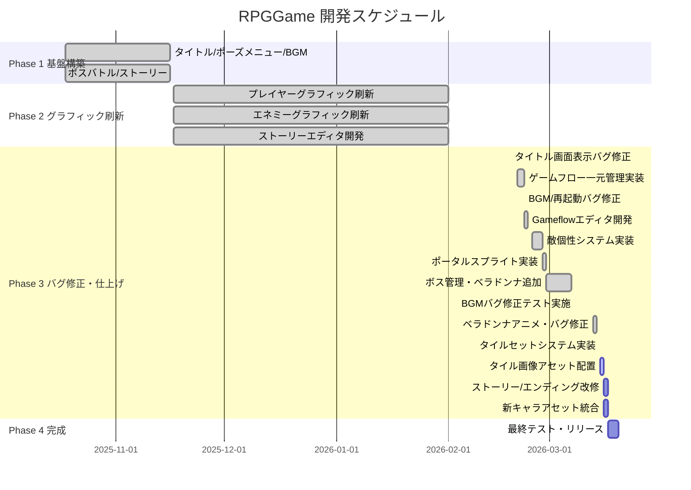

# RPGGame プロジェクト進捗状況

**更新日時**: 2026-03-15（本日更新）
**現在のフェーズ**: Phase 3 仕上げ → タイルセット実装完了・残タスク実装フェーズ
**現在のブランチ**: `developer`

---

## 📈 進捗状況

- ✅ 完了済み機能: 17個
- 🚧 テスト待ち: 1件（BGMマップ再生バグ修正）
- 🟡 部分実装: 2件（ひんし状態・mapエディタNPC/ポータル配置）
- ⏳ 残タスク: 5件（タイル画像アセット・アセット統合・特殊攻撃・bad1.json接続等）

**全体進捗: 約93%**

---

## ✅ 完了済み機能

| # | 機能 | コミット | 状態 |
|---|------|----------|------|
| 1 | タイトル画面実装 | 初期 | ✅ 完了 |
| 2 | ポーズメニュー実装 | 初期 | ✅ 完了 |
| 3 | BGM管理システム | 初期 | ✅ 完了 |
| 4 | タッチ操作対応（仮想ジョイスティック・攻撃ボタン） | 初期 | ✅ 完了 |
| 5 | ボスバトルシステム | 初期 | ✅ 完了 |
| 6 | ストーリーシステム | 初期 | ✅ 完了 |
| 7 | ゲーム状態管理システム | 初期 | ✅ 完了 |
| 8 | ゲームフロー一元管理システム（gameflow.json）← `story改修案`・`editor改修案(2)` 対応 | d8b7339 | ✅ 完了 |
| 9 | Gameflowエディタ（Blueprint風ノードエディタ） | 2db8df6 | ✅ 完了 |
| 10 | 敵個性システム（EnemySpeech/enemy-defs/セリフ）← `enemy改修案` 一部対応 | f43dcb1 | ✅ 完了 |
| 11 | enemy-editor（tools/enemy-editor/）← `enemy改修案` エディタ部分対応 | f43dcb1 | ✅ 完了 |
| 12 | mapエディタをtools移動 + 敵選択モーダル ← `map改修案_3_1`・`editor改修案` 対応 | f43dcb1 | ✅ 完了 |
| 13 | ポータルスプライトシステム | 66936b6 | ✅ 完了 |
| 14 | ボス設定のgameflow.json管理化 | 453e727 | ✅ 完了 |
| 15 | ベラドンナボス追加 | 411d4ff | ✅ 完了 |
| 16 | ベラドンナアニメーション + 歩き移動追加 / ボス・ポータルバグ修正 | fd38b72 | ✅ 完了 |
| 17 | タイルセットシステム実装（複数デザイン + アニメタイル + マップエディタ改修） | 753b2ad | ✅ 完了 |

---

## 🔧 解決済み問題

| 問題 | 解決策 | 解決日 |
|------|--------|--------|
| 古いコンパイル済みJSファイル問題 | `find src -name '*.js' -delete` で全削除 | 2025-11-16 |
| ストーリー終了後のシーン遷移 | returnToを'title'に変更 | 2025-11-16 |
| ポーズメニューの位置ずれ | setScrollFactor(0)を追加 | 2025-11-16 |
| ポーズメニューのボタン当たり判定ずれ | show()時にカメラ位置基準で動的配置 | 2025-11-16 |
| BGMマップ再生なし | `story-end`→`story:end` イベント名統一 | 2026-02-22 |
| 2回目プレイ時マップ非表示 | `walls` を optional 型に変更、`create()` でリセット | 2026-02-22 |
| タイトル画面の表示バグ | MainScene stop + TitleScene カメラリセット追加 | 2026-02-18 |
| BGMマップ再生バグ（3件） | stopAll削除・fade:0即時再生・destroy()リスナー修正 | 2026-02-23 |
| dying状態でのdead遷移バグ | 修正済み | 3ba6bfc |

---

## 🚨 現在の問題

| 問題 | 説明 | 優先度 |
|------|------|--------|
| BGMマップ再生バグ修正のテスト未実施 | stopAll削除・fade:0・destroy()リスナー修正を実装済みだが動作確認が未実施 | 🔴 高 |

---

## 📦 未統合アセット・残タスク

### 未コミットアセット

| ファイル | 内容 | 優先度 |
|---------|------|--------|
| `ArisaPlus.png` | 新キャラクタースプライト | 🔴 高 |
| `Girl_plus.png` | 新キャラクタースプライト | 🔴 高 |
| `public/assets/story/scripts/bad1.json` | BAD ENDストーリースクリプト（作成済み・未接続） | 🔴 高 |
| `public/assets/maps/map.json` | 新マップデータ（作成済み・未接続） | 🟡 中 |
| `rayout.apd / rayout.png` | レイアウトファイル | 🟡 中 |

### 改修案の残タスク（部分または全未実装）

| 改修案 | 残タスク | 優先度 |
|--------|----------|--------|
| `enemy改修案.txt` | ひんし状態の追加（HP10以下でひんしアニメ連続再生） | 🟡 中 |
| `editor改修案.txt` | mapエディタへのNPC配置チップ・ポータル配置チップ追加 | 🟡 中 |
| `player改修案2_15.txt` | プレイヤー改修仕様の確認・実装 | 🟡 中 |
| `player改修案2_18.txt` | 特殊攻撃（ファイヤーボール）の実装 | 🟡 中 |
| `story改修案2_18.txt` / `editor改修案(2).txt` | ✅ gameflow.json + Gameflowエディタで対応済み | — |
| `map改修案_3_1.txt` | ✅ tools/map-editor移動 + 敵選択モーダルで対応済み | — |

---

## 📅 開発スケジュール

---

## 🎯 次にやるべきタスク（優先度順）

1. **[🔴 最高] タイルセット用画像アセット配置** — `public/assets/images/tiles/` に実画像を追加してアニメタイルの動作確認
2. **[🔴 最高] BGMマップ再生バグ修正のテスト実施** — 実装済み修正（stopAll削除・fade:0・destroy()リスナー）の動作確認
3. **[🔴 高] bad1.json をゲームに接続** — BAD ENDスクリプトが作成済みだがgameflow.jsonに未接続
4. **[🔴 高] 新キャラアセット統合** — `ArisaPlus.png` / `Girl_plus.png` をゲームに組み込む
5. **[🟡 中] 敵ひんし状態の実装** — HP10以下でひんしアニメ連続再生（`enemy改修案.txt` の残タスク）
6. **[🟡 中] mapエディタへのNPC/ポータル配置機能追加** — `editor改修案.txt` の残タスク
7. **[🟡 中] player特殊攻撃の実装** — ファイヤーボール（`player改修案2_18.txt`）
8. **[🟢 低] developer を main にマージ** — 現ブランチの安定化後

---

## 📝 最近のコミット履歴

| コミット | 説明 | 日付 |
|---------|------|------|
| 753b2ad | Feat: タイルセットシステム実装 - マップチップ複数デザイン + アニメーションタイル対応 | 2026-03-15 |
| fd38b72 | Feat: ベラドンナアニメーション + 歩き移動追加 / ボス・ポータルバグ修正 | 2026-03-14頃 |
| 411d4ff | Feat: ベラドンナボス追加 + ゲームフローエディタ反映 | 2026-03-07頃 |
| 453e727 | Feat: ボス設定をgameflow.json管理に移行 + /boss スキル追加 | 2026-03-06頃 |
| 66936b6 | Feat: ポータルスプライトシステム実装 + マップ/ゲームフローエディタ対応 | 2026-02-28頃 |
| f43dcb1 | Feat: 敵個性システム実装（enemy-defs/EnemySpeech/spriteKey-animKey対応）| 2026-02-27頃 |
| 2db8df6 | Feat: Gameflowエディタ実装 + BGMマップ再生バグ修正3件 | 2026-02-23 |
| d8b7339 | Feat: ゲームフロー一元管理システム実装 + BGM/再起動バグ修正 | 2026-02-22 |
