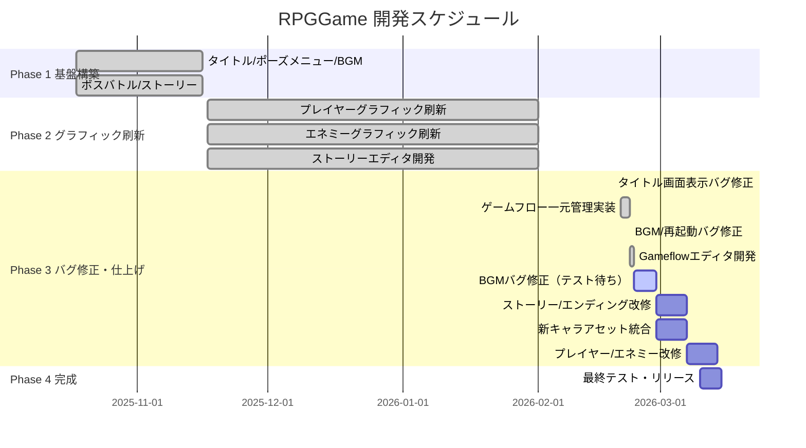

# RPGGame プロジェクト進捗状況

**更新日時**: 2026-02-28（本日更新）
**現在のフェーズ**: Gameflowエディタ完成 → BGMテスト・ストーリー/キャラ改修実装フェーズ
**現在のブランチ**: `feature/title-screen-and-pause-menu`

---

## 📈 進捗状況

- ✅ 完了済み機能: 9個
- 🚧 テスト待ち: 1件（BGMマップ再生バグ修正）
- ⏳ 未統合アセット: 6ファイル（新キャラクタースプライトなど）

**全体進捗: 約92%**

---

## ✅ 完了済み機能

| # | 機能 | 状態 |
|---|------|------|
| 1 | タイトル画面実装 | ✅ 完了 |
| 2 | ポーズメニュー実装 | ✅ 完了 |
| 3 | BGM管理システム | ✅ 完了 |
| 4 | タッチ操作対応（仮想ジョイスティック・攻撃ボタン） | ✅ 完了 |
| 5 | ボスバトルシステム | ✅ 完了 |
| 6 | ストーリーシステム | ✅ 完了 |
| 7 | ゲーム状態管理システム | ✅ 完了 |
| 8 | ゲームフロー一元管理システム（gameflow.json） | ✅ 完了 |
| 9 | Gameflowエディタ（Blueprint風ノードエディタ） | ✅ 完了 |

---

## 🔧 解決済み問題

| 問題 | 解決策 | 解決日 |
|------|--------|--------|
| 古いコンパイル済みJSファイル問題 | `find src -name '*.js' -delete` で全削除 | 2025-11-16 |
| ストーリー終了後のシーン遷移 | returnToを'title'に変更 | 2025-11-16 |
| ポーズメニューの位置ずれ | setScrollFactor(0)を追加 | 2025-11-16 |
| ポーズメニューのボタン当たり判定ずれ | show()時にカメラ位置基準で動的配置 | 2025-11-16 |
| dying状態でのdead遷移バグ | 修正済み | 最新コミット |
| BGMマップ再生なし | BGMManager の `story-end`→`story:end` イベント名統一 | 2026-02-22 |
| 2回目プレイ時マップ非表示 | `walls` を optional 型に変更、`create()` でリセット | 2026-02-22 |
| タイトル画面の表示バグ | MainScene stop + TitleScene カメラリセット追加 | 2026-02-18 |
| BGMマップ再生バグ（3件） | stopAll削除・fade:0即時再生・destroy()リスナー修正 | 2026-02-23 |

---

## 🚨 現在の問題

| 問題 | 説明 | 優先度 |
|------|------|--------|
| BGMマップ再生バグ修正のテスト未実施 | StoryScene.stopAll()削除・BGMManager.fade:0・destroy()リスナー修正を実装済みだが動作確認が未実施 | 🔴 高 |

---

## 📦 未統合アセット（要対応）

| ファイル | 内容 |
|---------|------|
| `ArisaPlus.png` | 新キャラクタースプライト |
| `Belladonna.png` | 新キャラクタースプライト |
| `Girl_plus.png` | 新キャラクタースプライト |
| `vamp2.png` | 新キャラクタースプライト |
| `rayout.apd / rayout.png` | レイアウトファイル |
| `enemy改修案.txt` | エネミー改修仕様（未実装） |
| `player改修案2_15.txt` | プレイヤー改修仕様（未実装） |
| `player改修案2_18.txt` | プレイヤー改修仕様・追記版（未実装） |
| `story改修案2_18.txt` | ストーリー/エンディング改修仕様（未実装） |

---

## 📅 開発スケジュール

---

## 🎯 次にやるべきタスク（優先度順）

1. **[🔴 最高] BGMマップ再生バグ修正のテスト実施** - 実装済み修正（stopAll削除・fade:0・destroy()リスナー）の動作確認
2. **[🔴 高] ストーリー/エンディング改修** - `story改修案2_18.txt` の仕様（マップ別BAD END/GOOD END）を実装
3. **[🔴 高] 新キャラアセットの統合** - ArisaPlus/Belladonna/Girl_plus/vamp2 をゲームに組み込む
4. **[🟡 中] player/enemy改修案の実装** - `player改修案2_15.txt` / `player改修案2_18.txt` / `enemy改修案.txt` の内容を確認・実装
5. **[🟢 低] feature/title-screen-and-pause-menu をmainにマージ** - 現ブランチの安定化後

---

## 📝 最近のコミット履歴

| コミット | 説明 |
|---------|------|
| 2db8df6 (2026-02-23) | Feat: Gameflowエディタ実装 + BGMマップ再生バグ修正3件 |
| d8b7339 (2026-02-22) | Feat: ゲームフロー一元管理システム実装 + BGM/再起動バグ修正 |
| 3ba6bfc | Fix: dying状態でのdead遷移バグ修正とエネミーHP値の引き上げ |
| (2026-02-18) | Fix: タイトル画面の表示バグ修正（MainScene paused状態がTitleSceneを隠す問題） |
| 3ba6bfc | Fix: dying状態でのdead遷移バグ修正とエネミーHP値の引き上げ |
| 2c36c16 | Revamp enemy graphics: new sprites with chroma key, idle/dying/dead animations |
| 132eb26 | Revamp player graphics: hero.png with chroma key and new animations |
| fb7cd82 | Fix story editor preview to match game coordinates |
| 79234f5 | Replace UI buttons with custom image assets |
