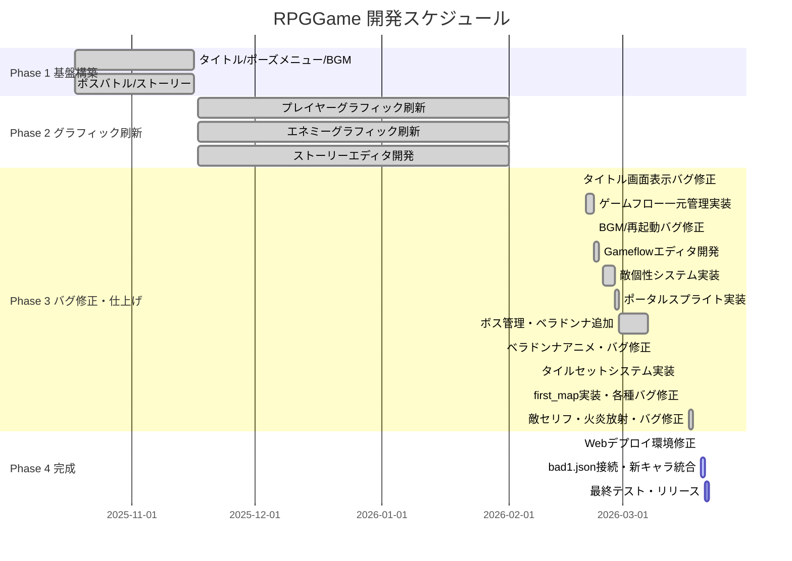

# RPGGame プロジェクト進捗状況

**更新日時**: 2026-03-20（本日更新）
**現在のフェーズ**: Phase 4 完成 → 最終テスト・リリースフェーズ
**現在のブランチ**: `developer`

---

## 📈 進捗状況

- ✅ 完了済み機能: 20個（+Webデプロイ環境構築）
- 🟡 部分実装: 2件（ひんし状態・mapエディタNPC/ポータル配置）
- ⏳ 残タスク: 2件（bad1.json接続・新キャラアセット統合）

**全体進捗: 約97%**

---

## ✅ 完了済み機能

| # | 機能 | コミット | 状態 |
|---|------|----------|------|
| 1 | タイトル画面実装 | 初期 | ✅ 完了 |
| 2 | ポーズメニュー実装 | 初期 | ✅ 完了 |
| 3 | BGM管理システム | 初期 | ✅ 完了 |
| 4 | タッチ操作対応（仮想ジョイスティック・攻撃ボタン） | 初期 | ✅ 完了 |
| 5 | ボスバトルシステム | 初期 | ✅ 完了 |
| 6 | ストーリーシステム | 初期 | ✅ 完了 |
| 7 | ゲーム状態管理システム | 初期 | ✅ 完了 |
| 8 | ゲームフロー一元管理システム（gameflow.json）← `story改修案`・`editor改修案(2)` 対応 | d8b7339 | ✅ 完了 |
| 9 | Gameflowエディタ（Blueprint風ノードエディタ） | 2db8df6 | ✅ 完了 |
| 10 | 敵個性システム（EnemySpeech/enemy-defs/セリフ）← `enemy改修案` 一部対応 | f43dcb1 | ✅ 完了 |
| 11 | enemy-editor（tools/enemy-editor/）← `enemy改修案` エディタ部分対応 | f43dcb1 | ✅ 完了 |
| 12 | mapエディタをtools移動 + 敵選択モーダル ← `map改修案_3_1`・`editor改修案` 対応 | f43dcb1 | ✅ 完了 |
| 13 | ポータルスプライトシステム | 66936b6 | ✅ 完了 |
| 14 | ボス設定のgameflow.json管理化 | 453e727 | ✅ 完了 |
| 15 | ベラドンナボス追加 | 411d4ff | ✅ 完了 |
| 16 | ベラドンナアニメーション + 歩き移動追加 / ボス・ポータルバグ修正 | fd38b72 | ✅ 完了 |
| 17 | タイルセットシステム実装（複数デザイン + アニメタイル + マップエディタ改修） | 753b2ad | ✅ 完了 |
| 18 | first_map実装 + タイルセット/マップエディタ修正 + マップ描画修正 | 1e0b18c | ✅ 完了 |
| 19 | 敵セリフをシーケンス再生に変更（表示→インターバル→次のセリフ） | 81b851b | ✅ 完了 |
| 20 | ダメージフラッシュ・音声機能・火炎放射攻撃 ← `player改修案2_18.txt` 対応 | 39ecf75 | ✅ 完了 |

---

## 🔧 解決済み問題

| 問題 | 解決策 | 解決日 |
|------|--------|--------|
| 古いコンパイル済みJSファイル問題 | `find src -name '*.js' -delete` で全削除 | 2025-11-16 |
| ストーリー終了後のシーン遷移 | returnToを'title'に変更 | 2025-11-16 |
| ポーズメニューの位置ずれ | setScrollFactor(0)を追加 | 2025-11-16 |
| ポーズメニューのボタン当たり判定ずれ | show()時にカメラ位置基準で動的配置 | 2025-11-16 |
| BGMマップ再生なし | `story-end`→`story:end` イベント名統一 | 2026-02-22 |
| 2回目プレイ時マップ非表示 | `walls` を optional 型に変更、`create()` でリセット | 2026-02-22 |
| タイトル画面の表示バグ | MainScene stop + TitleScene カメラリセット追加 | 2026-02-18 |
| BGMマップ再生バグ（3件） | stopAll削除・fade:0即時再生・destroy()リスナー修正 | 2026-02-23 |
| dying状態でのdead遷移バグ | 修正済み | 3ba6bfc |
| maptip画像ロード失敗・first_map未表示・ボス未出現 | ロード処理・マップ/ボス出現修正 | 3e421bd (2026-03-16) |
| 遠距離攻撃・SE・ボス演出の複数バグ | 各種修正 | 5ba389f (2026-03-17) |
| ベラドンナ弾ダメージ・敵AI停止・死亡後セリフ・コンソールエラー | 各種修正 | f39b562 (2026-03-18) |
| ストーリー遷移時のBGM重複再生 | 修正済み | 0e73066 (2026-03-18) |
| Webデプロイ時のアセット404 | vite base・deploy.yml の server-dir を `/htdocs/Game_RPG/` に修正 | 4c5ef65 (2026-03-20) |

---

## 🚨 現在の問題

現時点で既知の未解決問題はありません。

---

## 📦 残タスク

### 未統合アセット・未接続機能

| ファイル/機能 | 内容 | 優先度 |
|---------|------|--------|
| `public/assets/story/scripts/bad1.json` | BAD ENDストーリースクリプト（作成済み・未接続） | 🔴 高 |
| `ArisaPlus.png` / `Girl_plus.png` | 新キャラクタースプライト（未統合） | 🔴 高 |

### 改修案の残タスク（部分または全未実装）

| 改修案 | 残タスク | 優先度 |
|--------|----------|--------|
| `enemy改修案.txt` | ひんし状態の追加（HP10以下でひんしアニメ連続再生） | 🟡 中 |
| `editor改修案.txt` | mapエディタへのNPC配置チップ・ポータル配置チップ追加 | 🟡 中 |
| `player改修案2_18.txt` | ✅ 火炎放射攻撃で対応済み | — |
| `story改修案2_18.txt` / `editor改修案(2).txt` | ✅ gameflow.json + Gameflowエディタで対応済み | — |
| `map改修案_3_1.txt` | ✅ tools/map-editor移動 + 敵選択モーダルで対応済み | — |

---

## 📅 開発スケジュール

```mermaid
gantt
    title RPGGame 開発スケジュール
    dateFormat YYYY-MM-DD
    section Phase 1 基盤構築
    タイトル/ポーズメニュー/BGM    :done, phase1a, 2025-10-18, 2025-11-16
    ボスバトル/ストーリー           :done, phase1b, 2025-10-18, 2025-11-16
    section Phase 2 グラフィック刷新
    プレイヤーグラフィック刷新      :done, phase2a, 2025-11-17, 2026-02-01
    エネミーグラフィック刷新        :done, phase2b, 2025-11-17, 2026-02-01
    ストーリーエディタ開発          :done, phase2c, 2025-11-17, 2026-02-01
    section Phase 3 バグ修正・仕上げ
    タイトル画面表示バグ修正        :done, phase3a, 2026-02-18, 2026-02-18
    ゲームフロー一元管理実装        :done, phase3b, 2026-02-20, 2026-02-22
    BGM/再起動バグ修正             :done, phase3c, 2026-02-22, 2026-02-22
    Gameflowエディタ開発            :done, phase3d, 2026-02-22, 2026-02-23
    敵個性システム実装              :done, phase3e, 2026-02-24, 2026-02-27
    ポータルスプライト実装          :done, phase3f, 2026-02-27, 2026-02-28
    ボス管理・ベラドンナ追加        :done, phase3g, 2026-02-28, 2026-03-07
    ベラドンナアニメ・バグ修正      :done, phase3i, 2026-03-09, 2026-03-09
    タイルセットシステム実装        :done, phase3j, 2026-03-15, 2026-03-15
    first_map実装・各種バグ修正     :done, phase3k, 2026-03-16, 2026-03-16
    敵セリフ・火炎放射・バグ修正    :done, phase3l, 2026-03-17, 2026-03-18
    section Phase 4 完成
    Webデプロイ環境修正             :done, phase4a, 2026-03-20, 2026-03-20
    bad1.json接続・新キャラ統合     :active, phase4b, 2026-03-20, 2026-03-21
    最終テスト・リリース            :phase4c, 2026-03-21, 2026-03-22
```

---

## 🎯 次にやるべきタスク（優先度順）

1. **[🔴 高] bad1.json をゲームに接続** — BAD ENDスクリプトが作成済みだがgameflow.jsonに未接続
2. **[🔴 高] 新キャラアセット統合** — `ArisaPlus.png` / `Girl_plus.png` をゲームに組み込む
3. **[🟡 中] 敵ひんし状態の実装** — HP10以下でひんしアニメ連続再生（`enemy改修案.txt` の残タスク）
4. **[🟡 中] mapエディタへのNPC/ポータル配置機能追加** — `editor改修案.txt` の残タスク

---

## 📝 最近のコミット履歴

| コミット | 説明 | 日付 |
|---------|------|------|
| 4c5ef65 | Fix: デプロイパスを /htdocs/Game_RPG/ に修正（vite.config + deploy.yml） | 2026-03-20 |
| 0e6c058 | Feat: FTPによるNetowl自動デプロイのCI/CD設定を追加 | 2026-03-19 |
| 0e73066 | Fix: ストーリー遷移時のBGM重複再生を修正 | 2026-03-18 |
| f39b562 | Fix: ベラドンナ弾ダメージ・敵AI停止・死亡後セリフ・コンソールエラーを修正 | 2026-03-18 |
| 5ba389f | Fix: 遠距離攻撃・SE・ボス演出の複数バグを修正 | 2026-03-17 |
| 39ecf75 | Feat: ダメージフラッシュ・音声機能・火炎放射攻撃を実装 (改修案_3_17) | 2026-03-17 |
| 81b851b | Feat: 敵セリフをシーケンス再生に変更 | 2026-03-17 |
| a4f2ece | Merge developer: maptip画像ロード・first_map・ボス出現バグ修正 | 2026-03-16 |
| 3e421bd | Fix: maptip画像ロード失敗・first_map未表示・ボス未出現を修正 | 2026-03-16 |
| 1e0b18c | Feat: first_map実装 + タイルセット/マップエディタ修正 + マップ描画修正 | 2026-03-16 |
| 753b2ad | Feat: タイルセットシステム実装 - マップチップ複数デザイン + アニメーションタイル対応 | 2026-03-15 |
| fd38b72 | Feat: ベラドンナアニメーション + 歩き移動追加 / ボス・ポータルバグ修正 | 2026-03-09 |
| 411d4ff | Feat: ベラドンナボス追加 + ゲームフローエディタ反映 | 2026-03-03 |
| 453e727 | Feat: ボス設定をgameflow.json管理に移行 + /boss スキル追加 | 2026-03-02 |
| 66936b6 | Feat: ポータルスプライトシステム実装 + マップ/ゲームフローエディタ対応 | 2026-03-02 |
| f43dcb1 | Feat: 敵個性システム実装（enemy-defs/EnemySpeech/spriteKey-animKey対応）| 2026-03-01 |
| 2db8df6 | Feat: Gameflowエディタ実装 + BGMマップ再生バグ修正3件 | 2026-02-23 |
| d8b7339 | Feat: ゲームフロー一元管理システム実装 + BGM/再起動バグ修正 | 2026-02-22 |
